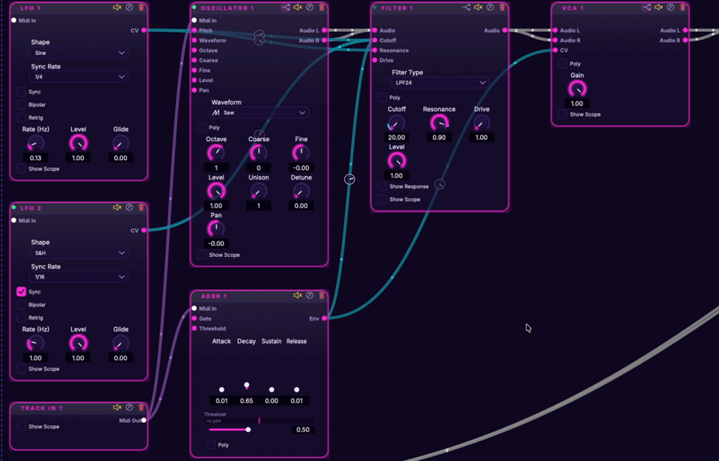

# Agent Synth

[](https://github.com/Diabl0269/agentsynth/actions/workflows/build-artifacts.yml)
[](https://github.com/Diabl0269/agentsynth/releases/latest)
[](LICENSE)

A free, open-source modular synth. Patch oscillators, filters, envelopes and effects
together in a node graph, play it from a keyboard or sequencer, and use it standalone
or as a VST3/AU plugin in your DAW.



*From [Macros in Agent Synth](https://youtu.be/Ot4gqm3FoaE) — full patching walkthrough on YouTube.*

Built by one person, MIT-licensed, early but shipping. macOS (Apple Silicon), Windows
and Linux. There's an experimental AI assistant that builds patches from a text
description; the synth doesn't depend on it.

**Get it:** [latest release](https://github.com/Diabl0269/agentsynth/releases/latest) — app + plugin zips, installer, `SHA256SUMS.txt`. Or [build from source](#building). Site: https://agentsynth.app.

## What's in the box

Agent Synth provides a visual patching environment where audio modules can be freely connected to create complex sounds. Each module processes audio and/or control signals, enabling everything from simple subtractive synthesis to elaborate modulation chains.

### Core Modules
- **Oscillator**: Anti-aliased waveform generator (Sine, Saw, Square, Triangle).
- **Filter**: Resonant low-pass filter with cutoff/resonance control.
- **VCA**: Voltage Controlled Amplifier with parameter smoothing.
- **ADSR**: Envelope generator for amplitude/filter modulation.
- **LFO**: Modulation oscillator with glide and S&H modes.
- **Sequencer**: Step sequencer for melodic patterns.
- **MIDI Keyboard**: Interactive on-screen keyboard for real-time performance.

### FX Modules
- **Delay**: Interpolated delay with feedback and mix control.
- **Distortion**: 2x oversampled soft-clipping for harmonic warmth.
- **Reverb**: Lush algorithmic stereo reverb.

### Polyphony
- **Poly MIDI**: 8-voice voice management with LRU allocation.
- **Poly Sequencer**: Multi-voice pattern sequencing.

### Modulation System
Agent Synth uses a hidden **Attenuverter** node architecture for modulation routing:
- **Smart Cables**: CV connections display an interactive depth knob at the cable midpoint. Drag to adjust depth (bipolar ±100%), double-click to delete.
- **Mod Matrix Panel**: A panel listing all active CV connections with labelled sliders. Fully synced with the smart cable knobs in real time.
- **Panel Toggles**: Top-bar **Hide AI** and **Hide Matrix** buttons collapse panels to give the graph more space.

## AI Integration
> **Note**: The AI integration is currently in an experimental state and may not function as expected. There are plans to migrate the AI harness into a separate, closed-source project in the future. The core Agent Synth engine and modular synth will remain open-source forever.

- **AI Sound Designer**: Describe a sound in natural language and the AI generates the complete patch (modules, parameters, and connections).
- **One-Click Apply**: Instantly apply AI-generated patches to the graph editor.

## Help build it

Agent Synth is free and open source, built by one person. The most helpful contribution right
now is towards development time, one-off or monthly, at https://agentsynth.app/donate: it lets
me put more hours into this instead of other work, and hopefully one day most of them. Sharing
it with someone who'd use it, opening an issue with feedback, starring the repo, and code
contributions (see [CONTRIBUTING.md](CONTRIBUTING.md)) genuinely help too. No pressure, it
stays free either way.

## Building

Agent Synth uses CMake for its build system.

### Prerequisites
-   A C++20 compatible compiler (e.g., Clang, GCC, MSVC)
-   CMake (version 3.15 or newer)
-   JUCE (handled by CMake's FetchContent, no manual download needed)

### Steps

1.  **Clone the repository:**
    ```bash
    git clone https://github.com/Diabl0269/agentsynth.git
    cd agentsynth
    ```

2.  **Configure CMake:**
    Create a build directory and configure CMake. You can choose `Debug` or `Release` build types.

    *   **Debug Build (for development):**
        ```bash
        cmake -Bbuild -S. -DCMAKE_BUILD_TYPE=Debug
        ```
    *   **Release Build (for deployment):**
        ```bash
        cmake -Bbuild -S. -DCMAKE_BUILD_TYPE=Release
        ```

3.  **Build the application:**
    ```bash
    cmake --build build --target AgentSynth
    ```
    This will compile the application. On macOS, the executable will be found at `build/AgentSynth_artefacts/<BuildType>/Agent Synth.app`. On other platforms, the path might vary (e.g., `build/<BuildType>/Agent Synth`).

4.  **Run the application:**
    *   **macOS:**
        ```bash
        open "build/AgentSynth_artefacts/Release/Agent Synth.app"
        # or
        open "build/AgentSynth_artefacts/Debug/Agent Synth.app"
        ```
    *   **Linux/Windows (example for Release):**
        ```bash
        "./build/Release/Agent Synth"
        ```

> **Plugin builds**: The same build also produces VST3 (Linux/macOS/Windows) and AU (macOS) audio-plugin bundles wrapping the same engine and UI as the standalone app. Prebuilt plugin bundles ship alongside the app in every [release](https://github.com/Diabl0269/agentsynth/releases).

<details>
<summary>Development & Testing</summary>

### Project Structure
- `Source/`: Main source code
    - `Modules/`: Audio processing modules (Core, FX, Poly)
    - `UI/`: Graph editor and visual components
- `Tests/`: GoogleTest suite
- `docs/`: **Technical Documentation (Architecture, Module Specs)**
- `GEMINI.md`: **Developer Guide & Contribution Standards**

### Testing

Agent Synth uses GoogleTest for unit testing.

#### Running Unit Tests

By default, builds skip tests to save time. To build the test suite, configure with `-DENABLE_TESTS=ON`:

1.  **Configure CMake with tests enabled:**
    ```bash
    cmake -Bbuild -S. -DCMAKE_BUILD_TYPE=Release -DENABLE_TESTS=ON
    ```

2.  **Build the test suite:**
    ```bash
    cmake --build build --target Tests
    ```

3.  **Execute the tests:**
    ```bash
    ./build/Tests/Tests
    ```

#### Code Coverage

To generate a code coverage report (requires `llvm-cov` and `llvm-profdata`):

```bash
bash scripts/coverage.sh
```
This script will build the project with coverage flags, run the tests, and generate a detailed coverage report.

</details>

<details>
<summary>Roadmap</summary>

### UI/UX & Workflow
- [x] **FX Suite**: Delay, Distortion, Reverb.
- [x] **Anti-Aliasing**: High-quality oscillators.
- [x] **Patch Saving/Loading**: Full state persistence for complex graphs.
- [x] **Smart Cables & Mod Matrix**: Inline modulation depth control + matrix overview panel.
- [x] **Panel Toggles**: Hide/show AI and Mod Matrix panels from the top bar.
- [ ] **Drag-and-Drop Patching**: Improved visual connection workflow.

### Advanced Features
- **Wavetable Synthesis**: Support for custom wavetables and morphing.
- **Polyphonic Modulation**: Route LFOs/envelopes per voice.

### Vision: AI-Powered Sound Design
*Note: This roadmap for AI features will be fulfilled by a separate closed-source project in the future. Agent Synth itself remains the open-source foundation.*

- [x] **Local AI Integration**: Support for Ollama and local models.
- [x] **Natural Language Patching**: Text-to-patch generation.
- [ ] **Conversational Refinement**: Iterate on patches via chat.
- [ ] **Parameter Learning**: Train models on user sound preferences.

</details>

## License
MIT
